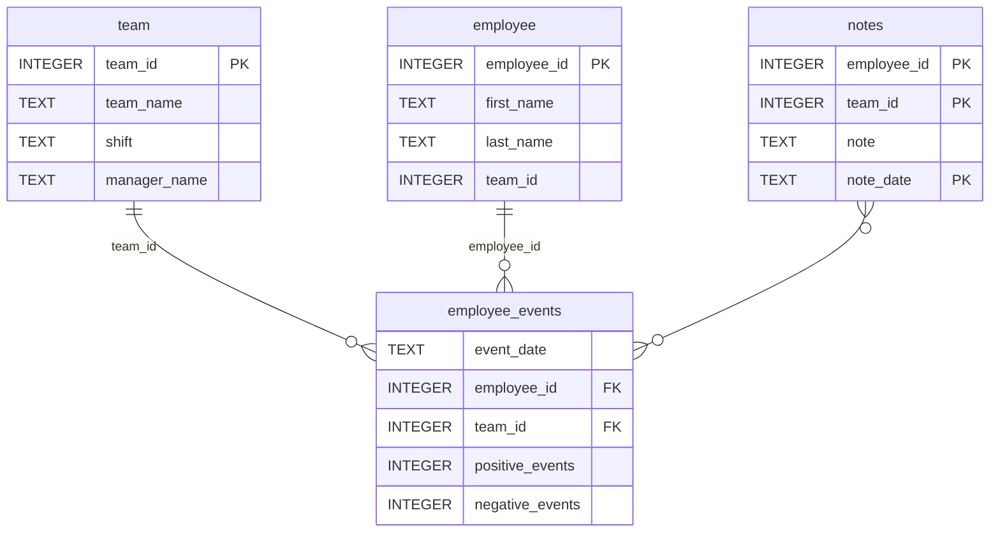

markdown# Software Engineering for Data Scientists 

This repository contains the **Software Engineering for Data Scientists** final project - an employee events dashboard with machine learning-based recruitment risk predictions.

## Project Overview

A Python package and FastHTML dashboard for analyzing employee and team events data. The system provides:
- SQL-based data querying with object-oriented design
- Interactive web dashboard with real-time filtering
- Data visualizations showing cumulative events over time
- Machine learning predictions for recruitment risk assessment

## Repository Structure
```
├── README.md
├── assets
│   ├── model.pkl                # Trained ML model
│   └── report.css               # Dashboard styling
├── python-package
│   ├── employee_events          # Core package
│   │   ├── __init__.py
│   │   ├── employee.py          # Employee queries
│   │   ├── employee_events.db   # SQLite database
│   │   ├── query_base.py        # Base query class
│   │   ├── sql_execution.py     # SQL decorators
│   │   └── team.py              # Team queries
│   ├── requirements.txt         # Package dependencies
│   ├── setup.py                 # Package configuration
│   └── dist/                    # Built distributions
├── report                       # Dashboard application
│   ├── base_components          # UI components
│   │   ├── __init__.py
│   │   ├── base_component.py
│   │   ├── data_table.py
│   │   ├── dropdown.py
│   │   ├── matplotlib_viz.py
│   │   └── radio.py
│   ├── combined_components      # Composite components
│   │   ├── __init__.py
│   │   ├── combined_component.py
│   │   └── form_group.py
│   ├── dashboard.py             # Main dashboard
│   └── utils.py                 # Utilities
├── requirements.txt             # Project dependencies
└── tests
    └── test_employee_events.py  # Unit tests
```

## Database Schema (employee_events.db)


## Setup Instructions

### Prerequisites
- Python 3.9 or higher
- pip package manager
- Git

### Installation

1. **Clone the repository:**
```bash
git clone https://github.com/Carlosgonzzzz98/dsnd-dashboard-project-carlosg.git
cd dsnd-dashboard-project-carlosg
```

2. **Install the employee_events package:**
```bash
cd python-package
pip install -r requirements.txt
python setup.py sdist
pip install dist/employee_events-*.tar.gz
cd ..
```

**Alternative - Development Mode:**
```bash
cd python-package
pip install -e .
cd ..
```

3. **Install dashboard dependencies:**
```bash
pip install python-fasthtml matplotlib pandas scikit-learn
```

## Running the Dashboard

Start the dashboard server:
```bash
python report/dashboard.py
```

The dashboard will be available at `http://localhost:5001`

### Navigation
- **Root:** `http://localhost:5001/` - Default view (Employee ID 1)
- **Specific employee:** `http://localhost:5001/employee/{id}`
- **Specific team:** `http://localhost:5001/team/{id}`

### Dashboard Features
- **Interactive Filters:** Switch between Employee and Team views
- **Dropdown Selection:** Choose specific employees or teams
- **Line Charts:** Cumulative positive/negative events over time
- **Bar Charts:** ML-predicted recruitment risk (0-1 scale)
- **Notes Table:** Historical notes for selected entities
- **Real-time Updates:** Dynamic content loading with HTMX

## Running Tests

Run all tests:
```bash
pytest tests/
```

Run tests from python-package directory:
```bash
cd python-package
pytest
```

Tests are automatically executed via GitHub Actions on every push and pull request.

## Development

### Building the Package
```bash
cd python-package
python setup.py sdist
```

The distribution file (`.tar.gz`) will be created in `python-package/dist/`

### Installing in Development Mode
```bash
cd python-package
pip install -e .
```

Changes to the package code will be immediately available without reinstalling.

### Project Dependencies

**Package dependencies** (`python-package/requirements.txt`):
- pandas
- sqlite3 (built-in)

**Dashboard dependencies:**
- python-fasthtml
- matplotlib
- pandas
- scikit-learn

## Machine Learning

The dashboard uses a trained Logistic Regression model (`assets/model.pkl`) to predict recruitment risk based on:
- Sum of positive events
- Sum of negative events

Output: Risk score from 0 (low risk) to 1 (high risk)

## Technologies

- **Python 3.9+** - Programming language
- **FastHTML** - Web framework
- **SQLite** - Database
- **Pandas** - Data manipulation
- **Matplotlib** - Visualization
- **Scikit-learn** - Machine learning
- **Pytest** - Testing
- **GitHub Actions** - CI/CD

## Continuous Integration

GitHub Actions automatically runs tests on:
- Push to `main` or `master` branches
- Pull requests to `main` or `master` branches

See `.github/workflows/test.yml` for configuration.

## License

[Add your license here]

## Authors

Carlos Gonzalez - [@Carlosgonzzzz98](https://github.com/Carlosgonzzzz98)

## Acknowledgments

Udacity Data Science Nanodegree Program